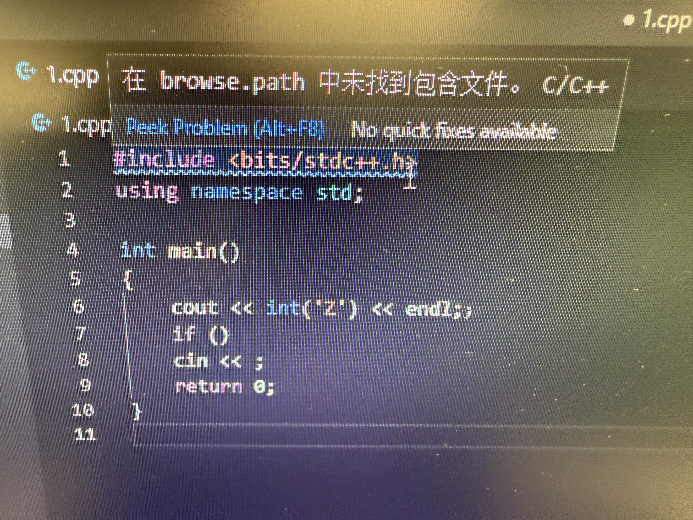
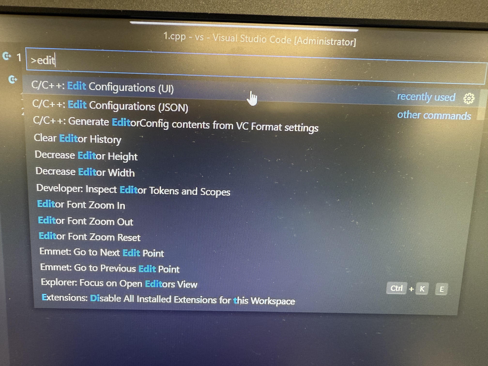
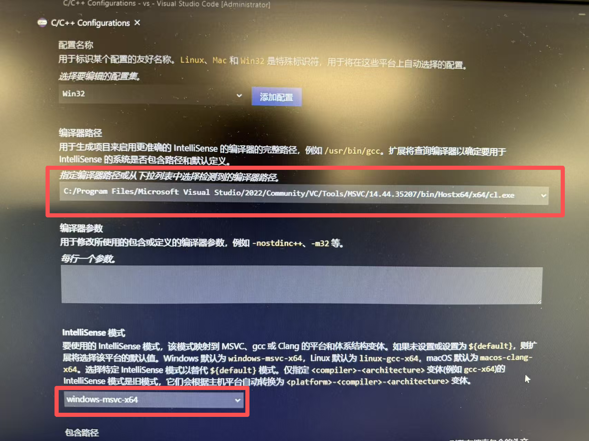
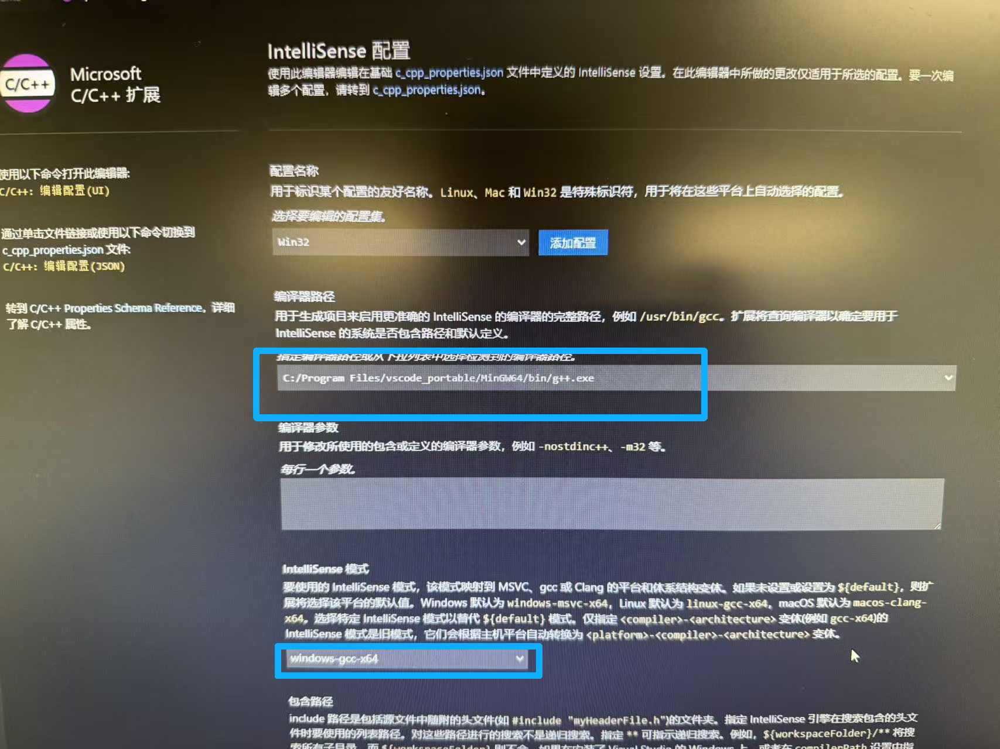
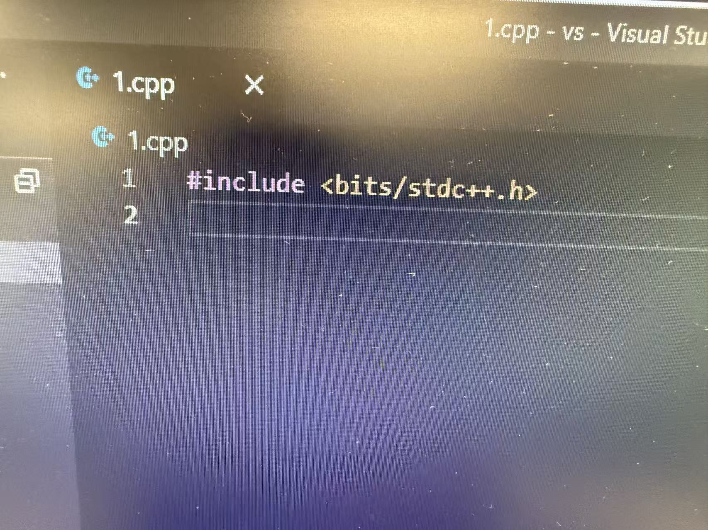
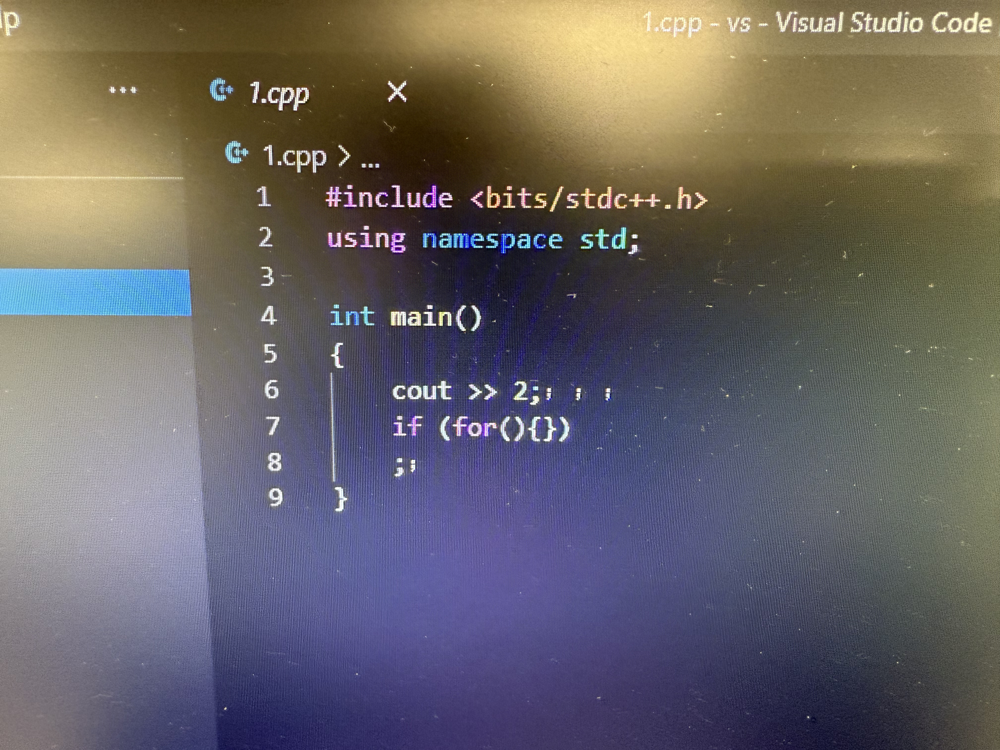
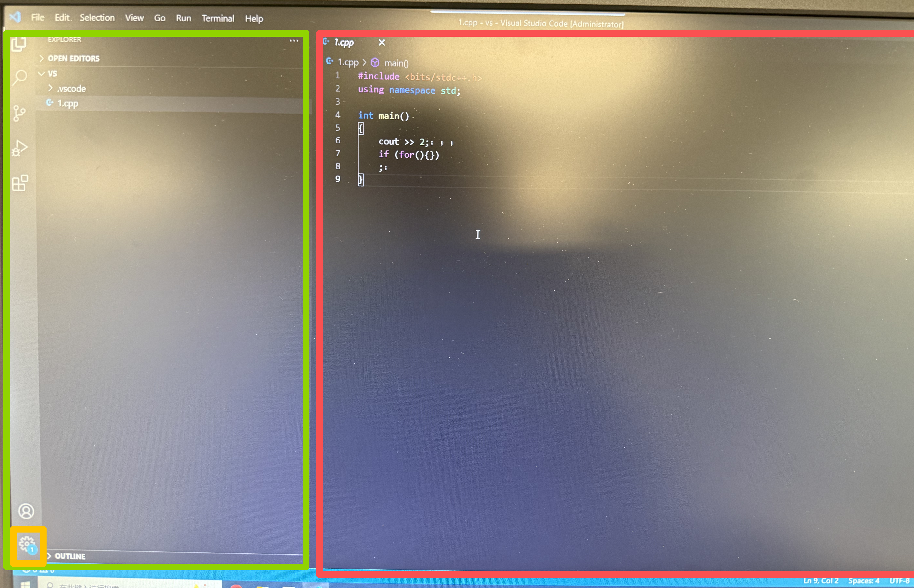
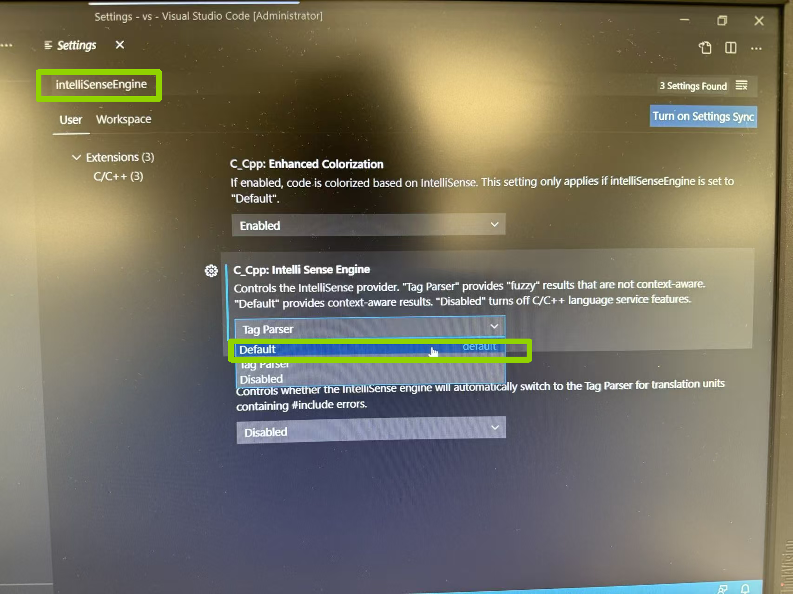
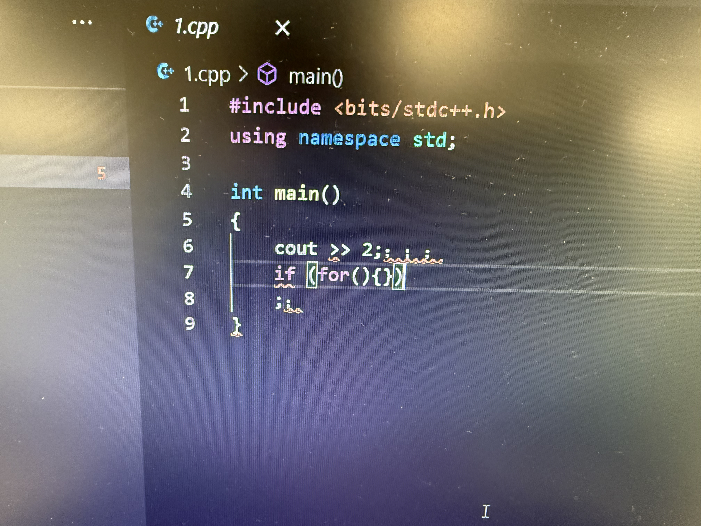

# 机房VS code初始设置（英文版）

### 如果您已经汉化，完全可以按照如下步骤*一模一样* 进行

## 

## 注意：！！！由于机房电脑只要关机，C盘就会恢复默认

## 所以VS code的 “设置与插件” 也会全部恢复默认

## 本文内容均需要在临近考试前 “确保不关机” 的情况下

## 对自己的考试电脑进行配置

## 1.字体太小：

### `Ctrl 配合 +`可以放大字号

### `Ctrl 配合 -`可以缩小字号

## 2. 万能头文件 `<bits/stdc++.h>` 缺失

### Step 1：`Ctrl Shift P` 输入`Edit`

### 找到  `C/C++:Edit Configurations(UI)`如图

### Step 2：修改2个参数

### (1)将编译器路径修改为以`g++`结尾的那个选项

### (2)将IntelliSense修改成匹配的`windows-gcc-x64`

### (3)！！！一定要按`Ctrl Shift S`保存设置

### 现在，万能头文件就修复完毕喽，现在可以正常使用`<bits/stdc++.h>`啦

## 

## 3. 不显示红波浪线报错

### 图中各种语法错误均无红波浪线提示，而且中英文标点符号竟然也不提示！！！

### Step 1：按下`Ctrl 逗号`打开settings（设置）

### ！！！鼠标一定要先点一下左边绿色的部分，然后再按`Ctrl 逗号`

### ！！！如果输入光标选中在右边红色部分，按`Ctrl 逗号`就会毫无反应

### 如果快捷键实在打不开，也可以点击图中黄色框内的齿轮，点击里面的`Settings`也可

### Step 2：搜索`errorSquiggles`，将选项修改为`Enabled`

### Step 3：搜索`intelliSenseEngine`,将中间的选项修改为`Default`

### 现在，红波浪线报错终于出现啦，这辈子第一次这么希望出现报错，哈哈哈

## 恭喜您已经完成了机房VS code的全部配置，祝您考试顺利，return 4.0;

教程文档作者：徐曼议 自56

关键技术支持：褚冠辰 计56

